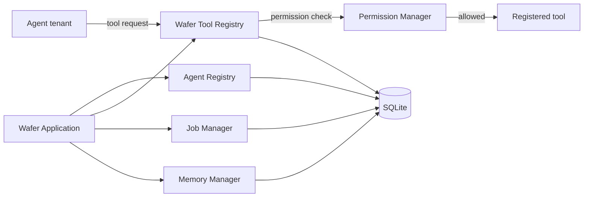

# Wafer Environment

Wafer is a local-first runtime and security control plane for specialized agents. It owns the tools, permissions, jobs, persistence, and application lifecycle. Agents are tenants that request capabilities through Wafer; an agent should not receive unrestricted operating-system access.

This is Wafer v0.1: a local-first runtime foundation. It includes one bounded reasoning agent behind a provider-neutral, host-injected model client and an optional OpenAI adapter, but no autonomous loop, voice, browser automation, GUI, or arbitrary shell execution. No agent is installed by default.

## Architecture



The runtime initializes configuration, structured logging, SQLite, agent and tool registries, job management, permissions, and the memory placeholder. `AgentRuntime` owns synchronous execution and lifecycle reporting for executable implementations registered in the existing agent registry. Agent identity metadata persists, while executable Python objects are registered by the host process. The database layer owns schema initialization for jobs, agents, tools, and future memory entries.

The host selects known executable implementations in `config.toml`:

```toml
[host]
enabled_agents = ["first"]
```

The list defaults to empty. It selects entries from the host's static implementation catalog (`first`, `request_echo`, and `error_explainer`); it does not load code or grant permissions. `error_explainer` also requires the host to supply a `ModelClient`; the real adapter is selected explicitly through `create_openai_host()`, not automatically by the CLI. Calling `Wafer()` directly remains agent-free.

## Agent execution

Executable agents implement `execute(request, context)`. Wafer's `AgentRuntime` validates the request, prepares a context, tracks lifecycle transitions, captures execution time, and returns an `AgentResult`. Calls to tools are exposed through the context and continue through Wafer's permission checks. `FirstAgent` is a deterministic, read-only inspector for the `wafer.health_check` task. It uses `wafer.runtime_status` and can optionally use `system.info`. It is not installed automatically.

`RequestEchoAgent` is a small independent contract example for `wafer.echo`. It reads a `message` from request context and an optional `prefix` from request configuration; it requires no tools or permissions.

`ErrorExplainerAgent` handles `wafer.explain_error` with one model call through the permission-checked `model.generate` tool. It sends only validated `error_text` and optional `operator_context`; the host must explicitly inject a provider-neutral model client, and the agent needs an exact `EXECUTE` grant on `model.generate`. Normal tests use a deterministic fake client and never contact the provider.

## Optional OpenAI adapter

The OpenAI adapter is an optional integration, not Wafer's default. Install it with `pip install -e ".[openai]"`, set `OPENAI_API_KEY` and `WAFER_OPENAI_MODEL` in the host environment, and add `error_explainer` to `[host].enabled_agents`. Then explicitly compose `create_openai_host(config_path)` from `app.host`; normal `create_host()` and `Wafer()` do not select or initialize OpenAI. Grant the agent `EXECUTE` on `model.generate` separately.

The adapter sends only the `ModelRequest` messages, the selected host model, a fixed output-token limit, and `store=false`. For ErrorExplainerAgent those messages contain its fixed instruction and the selected `error_text` / `operator_context`. It does not send request metadata, configuration, runtime state, tools, or credentials in the generation body. The SDK reads `OPENAI_API_KEY` from the environment for authentication; Wafer does not retain it.

The regular `python -m pytest` suite stays offline and uses `FakeModelClient`. To explicitly run the live smoke test, install the optional dependency, configure the environment above, set `WAFER_RUN_OPENAI_SMOKE=1`, and run `python -m pytest integration_tests/test_openai_smoke.py -q`. The smoke test skips when opt-in, credentials, model selection, or SDK are missing.

```python
from app.agents.first import FirstAgent
from app.agents.runtime import AgentRequest
from app.core.wafer import Wafer
from app.security.permissions import Permission

wafer = Wafer("config.toml")
wafer.register_agent(FirstAgent())
wafer.permission_manager.grant("first", Permission.READ, "wafer.runtime_status")
wafer.permission_manager.grant("first", Permission.READ, "system.info")
result = wafer.execute_agent(
    "first",
    AgentRequest("request-1", "wafer.health_check", context={"include_system_info": True}),
)
wafer.close()
```

## Security model

Tools declare a minimum permission (`READ`, `WRITE`, `EXECUTE`, or `ADMIN`). `ToolRegistry.execute_tool()` always asks Wafer's `PermissionManager` before calling the implementation. Registered agents have persistent identities and start with no grants. A grant can cover all tools (`*`) or one named tool, and permission levels are hierarchical: a `WRITE` grant also satisfies a `READ` requirement. A tool-specific grant applies only to that tool. Revoking a grant removes that exact scope.

Each decision, including denials for unknown agents, is written to SQLite with its timestamp, agent ID, tool, requested permission, result, and reason. The local CLI manages these policies. The separate developer `runtime` identity keeps the checked-in policy of `READ` granted and higher permissions denied. Shipped tools are `system.info`, `wafer.runtime_status`, and the host-configured `model.generate`; the model tool requires an explicit `EXECUTE` grant and does not log prompt payloads. The inspection tools expose system/runtime summaries and do not inspect user files or execute commands.

## Run Wafer

Requires Python 3.12 or later. From the repository root:

```powershell
python main.py
python main.py status
python main.py agents
python main.py tools
python main.py jobs
python main.py grant first READ --tool wafer.runtime_status
python main.py grant first READ --tool system.info
python main.py grant AGENT_ID READ --tool system.info
python main.py revoke AGENT_ID READ --tool system.info
python main.py decisions --limit 20
python main.py run first wafer.health_check
python main.py run first wafer.health_check --context '{"include_system_info": true}'
```

The first run creates `data/wafer.db`. Configuration is in `config.toml`; paths are resolved relative to that config file. Structured logs are written to stderr. The host attaches only IDs listed in `[host].enabled_agents`; an unknown ID is a configuration error. The first report can be `unknown` until the operator grants `READ` on `wafer.runtime_status`; grant `READ` on `system.info` to enable the optional host check. Enabling an agent does not create or change grants. Use `agents` to inspect identities and grants. Normal `Wafer()` startup still installs no executable agents. To run the tests, install pytest and run `python -m pytest`.

## Future agents

Agents can implement the execution interface in `app.agents.runtime` and register with `AgentRegistry`. They may describe capabilities, but operating-system actions must be represented by explicit registered tools and pass through the permission manager. Dynamic package installation is out of scope; no plugin marketplace or loader is present.

## Current limitations

- The OpenAI adapter is the only external model provider; no provider routing or automatic model selection is available.
- No background job workers, scheduling, or concurrency.
- Agent metadata and tool metadata persist, but executable plugin code is not dynamically restored.
- Memory defines experience, fact, preference, and procedure concepts and a minimal SQLite entry store; there are no embeddings or semantic retrieval.
- The developer `runtime` policy is a static allow-list; agent policies are persistent explicit grants.
- No graphical interface, browser or voice features, or arbitrary command execution.

## Next milestone

Evaluate the explicit OpenAI host path with the operator's privacy and data-retention requirements before enabling it for ordinary use; preserve the fake-backed offline suite.
