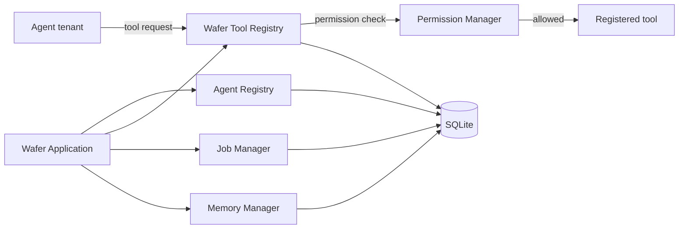

# Wafer Environment

Wafer is a local-first runtime and security control plane for specialized agents. It owns the tools, permissions, jobs, persistence, and application lifecycle. Agents are tenants that request capabilities through Wafer; an agent should not receive unrestricted operating-system access.

This is Wafer v0.1: a deterministic foundation only. It includes no model, autonomous agent, voice, browser automation, GUI, or arbitrary shell execution. No agent is installed by default.

## Architecture



The runtime initializes configuration, structured logging, SQLite, agent and tool registries, job management, permissions, and the memory placeholder. The database layer owns schema initialization for jobs, agents, tools, and future memory entries.

## Security model

Tools declare a minimum permission (`READ`, `WRITE`, `EXECUTE`, or `ADMIN`). `ToolRegistry.execute_tool()` always asks Wafer's `PermissionManager` before calling the implementation. Registered agents have persistent identities and start with no grants. A grant can cover all tools (`*`) or one named tool, and permission levels are hierarchical: a `WRITE` grant also satisfies a `READ` requirement. A tool-specific grant applies only to that tool. Revoking a grant removes that exact scope.

Each decision, including denials for unknown agents, is written to SQLite with its timestamp, agent ID, tool, requested permission, result, and reason. The local CLI manages these policies. The separate developer `runtime` identity keeps the checked-in policy of `READ` granted and higher permissions denied. The only shipped tool is `system.info`, which reports the OS, Python version, and machine architecture; it does not inspect user files or execute commands.

## Run Wafer

Requires Python 3.12 or later. From the repository root:

```powershell
python main.py
python main.py status
python main.py agents
python main.py tools
python main.py jobs
python main.py agents
python main.py grant AGENT_ID READ
python main.py grant AGENT_ID READ --tool system.info
python main.py revoke AGENT_ID READ --tool system.info
python main.py decisions --limit 20
```

The first run creates `data/wafer.db`. Configuration is in `config.toml`; paths are resolved relative to that config file. Structured logs are written to stderr. Agent IDs are established when an agent registers with Wafer; this milestone adds no agent or agent-creation command. Run `agents` to inspect identities and current grants before applying a policy. To run the tests, install pytest and run `python -m pytest`.

## Future agents

Future agents can implement the `Agent` protocol and register with `AgentRegistry`. They may describe capabilities, but operating-system actions must be represented by explicit registered tools and pass through the permission manager. Dynamic package installation is out of scope; no plugin marketplace or loader is present.

## Current limitations

- No model or reasoning configuration beyond the status display.
- No background job workers, scheduling, or concurrency.
- Agent metadata and tool metadata persist, but executable plugin code is not dynamically restored.
- Memory defines experience, fact, preference, and procedure concepts and a minimal SQLite entry store; there are no embeddings or semantic retrieval.
- The developer `runtime` policy is a static allow-list; agent policies are persistent explicit grants.
- No graphical interface, browser or voice features, or arbitrary command execution.

## Next milestone

Integrate the first agent only through the existing tool request boundary, beginning with a review of its requested tool permissions.
